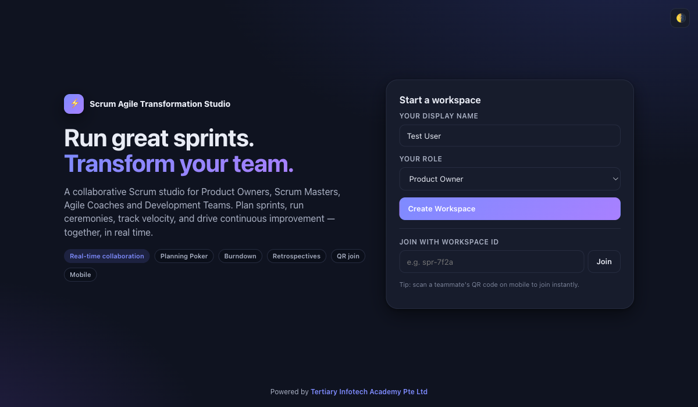

<div align="center">

# Scrum Agile Transformation Studio

[](https://developer.mozilla.org/en-US/docs/Web/HTML)
[](https://developer.mozilla.org/en-US/docs/Web/CSS)
[](https://developer.mozilla.org/en-US/docs/Web/JavaScript)
[](https://firebase.google.com/)
[](https://alfredang.github.io/scrum/)
[](https://opensource.org/licenses/MIT)

**Run great sprints. Transform your team.**

A modern, mobile-friendly, real-time collaborative web app for managing the full Scrum workflow — from product vision to retrospective.

[Live Demo](https://alfredang.github.io/scrum/) · [Report Bug](https://github.com/alfredang/scrum/issues) · [Request Feature](https://github.com/alfredang/scrum/issues)

</div>

## Screenshot



## About

**Scrum Agile Transformation Studio** is a single-file collaborative Scrum studio for Product Owners, Scrum Masters, Agile Coaches, Developers, and Stakeholders. It guides teams through every Scrum ceremony and the full agile transformation journey, with real-time Firebase collaboration and a localStorage demo-mode fallback.

### Key Features

| Module | Description |
|--------|-------------|
| 🎯 **Product Vision** | Vision statement, goals, personas, success metrics + collaborative sticky notes |
| 🗺️ **Product Roadmap** | 4-quarter drag-and-drop planning with epics, features, milestones |
| 📋 **Product Backlog** | User stories, epics, tasks, bugs with acceptance criteria, priority, points, votes, comments |
| 🃏 **Sprint Planning** | Sprint goals, capacity, drag-to-commit, **Planning Poker** (1, 2, 3, 5, 8, 13, 21) |
| 🧱 **Sprint Backlog** | 5-column Kanban (To Do / In Progress / In Review / Testing / Done) with touch drag |
| ☕ **Daily Scrum** | Yesterday / Today / Blockers per team member, 15-min timer, impediment tracker |
| 📈 **Sprint Execution** | Burndown chart, sprint health KPIs, completed-work view |
| 🎬 **Sprint Review** | Demo notes, checklist, stakeholder approve / request-changes |
| 🔁 **Retrospective** | 4 formats (Classic / Start-Stop-Continue / Mad-Sad-Glad / 4Ls), anonymous mode, voting, action items |
| 📊 **Agile Metrics** | Velocity, burnup, lead/cycle time, predictability, team happiness |
| 🚀 **Transformation** | 8-stage agile transformation roadmap with initiatives, owners, risks |

### Built-In Power
- ⚡ **Real-time collaboration** via Firebase Realtime Database (anonymous auth)
- 📱 **Mobile-first** — bottom nav, FAB, touch drag-and-drop, responsive boards
- 🔗 **QR-code workspace joining** — scan & join from any device
- 🌗 **Dark / light theme**
- 💾 **Offline demo mode** with localStorage cross-tab sync (no Firebase required)
- 📤 **Export** — JSON, CSV, printable HTML report
- 🔍 **Global search & filters** across stories, tasks, retros, comments

## Tech Stack

| Category | Technology |
|----------|-----------|
| **Frontend** | Pure HTML5, CSS3, vanilla JavaScript (no frameworks) |
| **Realtime Backend** | Firebase Realtime Database (compat SDK v10) |
| **Auth** | Firebase Anonymous Authentication |
| **QR Codes** | [QRCode.js](https://github.com/davidshimjs/qrcodejs) |
| **Charts** | Hand-rolled HTML5 Canvas (burndown, burnup, velocity, donut) |
| **Persistence Fallback** | `localStorage` with cross-tab `storage` events |
| **Deployment** | GitHub Pages (via GitHub Actions) |

## Architecture

```
┌─────────────────────────────────────────────────────────────┐
│                       Browser (mobile / desktop)            │
│  ┌────────────┐  ┌────────────┐  ┌────────────────────┐    │
│  │  Landing   │  │  App Shell │  │  Modals & Toasts   │    │
│  │  + QR Join │  │  (11 mods) │  │  (Story / Poker /  │    │
│  └────────────┘  └─────┬──────┘  │   Share / Export)  │    │
│                        │         └────────────────────┘    │
│                  ┌─────▼──────────────────┐                │
│                  │   State + UI Renderer  │                │
│                  └─────┬──────────────────┘                │
│                  ┌─────▼──────────────────┐                │
│                  │   Store (persistence)  │                │
│                  │   ┌───────┬──────────┐ │                │
│                  │   │ RTDB  │  local   │ │                │
│                  │   │ (sync)│ Storage  │ │                │
│                  │   └───────┴──────────┘ │                │
│                  └─────┬──────────────────┘                │
└────────────────────────┼─────────────────────────────────────┘
                         │
                  ┌──────▼──────────────┐
                  │ Firebase RTDB       │
                  │ workspaces/{wsId}   │
                  │   • vision          │
                  │   • backlog[]       │
                  │   • sprints[]       │
                  │   • dailyScrum[]    │
                  │   • retros[]        │
                  │   • collaborators   │
                  └─────────────────────┘
```

## Project Structure

```
scrum/
├── index.html        # Single-file app: HTML + CSS + JS + Firebase + QRCode.js
├── README.md
├── screenshot.png    # (auto-captured after first deploy)
└── .github/
    └── workflows/
        └── deploy.yml  # GitHub Pages deploy workflow
```

## Getting Started

### Prerequisites
- Any modern browser (Chrome, Safari, Firefox, Edge)
- *(Optional)* a Firebase project for cross-device sync

### Run locally
```bash
git clone https://github.com/alfredang/scrum.git
cd scrum
open index.html         # macOS — or just double-click the file
```

That's it. With no Firebase keys, the app runs in **local demo mode** using `localStorage` (cross-tab sync within one browser).

### Enable real-time collaboration (optional)
1. Create a Firebase project → enable **Realtime Database** and **Anonymous Authentication**.
2. Replace the `firebaseConfig` block at the top of the inline `<script>` in `index.html` with your project's config.
3. Set RTDB rules:
   ```json
   {
     "rules": {
       "workspaces": {
         "$wsId": {
           ".read":  "auth != null",
           ".write": "auth != null"
         }
       }
     }
   }
   ```
4. Open `index.html` — you should see the "Connected to Firebase Realtime Database" toast.

## Deployment

### GitHub Pages (auto via Actions)
This repo includes a `.github/workflows/deploy.yml` workflow that publishes the site to GitHub Pages on every push to `main`. Live URL:

> **https://alfredang.github.io/scrum/**

### Static hosting
Drop `index.html` onto Netlify, Vercel, Cloudflare Pages, S3, or any static host. No build step needed.

## Contributing

1. Fork the repo
2. Create a feature branch (`git checkout -b feat/my-feature`)
3. Commit your changes (`git commit -m "feat: add X"`)
4. Push (`git push origin feat/my-feature`)
5. Open a Pull Request

Issues, ideas, and feedback welcome via [GitHub Issues](https://github.com/alfredang/scrum/issues).

## Developed By

**[Tertiary Infotech Academy Pte Ltd](https://www.tertiarycourses.com.sg/)**

Singapore-based training provider specializing in software, AI, data, and digital skills courses.

## Acknowledgements

- [Firebase](https://firebase.google.com/) — realtime sync + anonymous auth
- [QRCode.js](https://github.com/davidshimjs/qrcodejs) — QR code rendering
- Inspired by modern agile collaboration tools such as [Miro Agile](https://miro.com/agile/)

---

<div align="center">

⭐ **If you find this project useful, give it a star on GitHub!** ⭐

</div>
